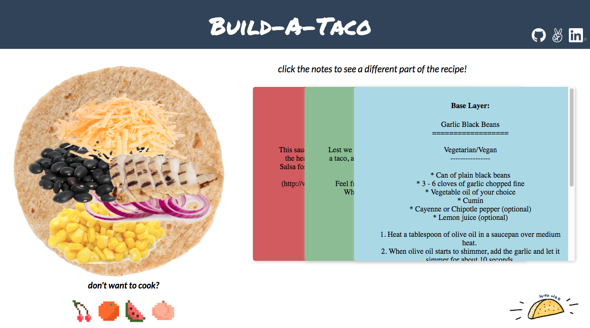

# DOManipulation README

## About
DOManipulation is a recreation of the most of the important functionalities of the jQuery library.
DOManipulation can be used to send AJAX requests, handle events, and manipulate the DOM.

Check out the live demo [here](https://claireskim.com/DOManipulation/)!


## Features
* `empty()`
* `append()`
* `children()`
* `parent()`
* `find()`
* `remove()`
* `on()`
* `off()`
* `$l.extend()`
* `$l.ajax()`

## AJAX Requests
One of the main features of DOManipulation is the ability to make AJAX requests, and have it return a promise.

``` javascript
$l.ajax = (arg) => {
  let recommended = {
    method: "GET",
    url: '',
    contentType:'application/x-www-form-urlencoded; charset=UTF-8',
    dataType: 'json',
    data: {},
    success: () => {},
    error: () => {},
  };

  const merged = $l.extend(recommended, arg);
  return new Promise((resolve,reject) => {
    const xhr = new XMLHttpRequest();
    xhr.open(merged.method, merged.url, true);
    xhr.onload = () => resolve(JSON.parse(xhr.response));
      xhr.send(JSON.stringify(merged.data));
  });
};
```

## Live Demo
[Build-A-Taco](https://claireskim.com/DOManipulation/), a website that provides different taco recipes, was created using DOManipulation. A random taco recipe is obtained by making an AJAX request to an API.

``` javascript
function base() {
  let base = $l('.base').htmlArray[0];
  $l.ajax({
    url: 'http://taco-randomizer.herokuapp.com/random/'
  }).then( (response) => {
    base.innerText = response.base_layer.recipe;
  });
  porkImage();
}
```

The z-index of the note cards are toggled depending on which card is currently selected. By using DOManipulation to add and remove classes that will set the z-index accordingly, I was able to get the desired effect of the note cards flipping. The dynamically changing images are also triggered by the on click of the note cards, which in turn changes the source of the image to a randomly generated one.

``` javascript
function cheeseImage() {
  let cheese = $l('.cheese').htmlArray[0];
  let rand = Math.floor((Math.random() * 2));
  cheese.src = CHEESEIMAGE[rand];
}
```
